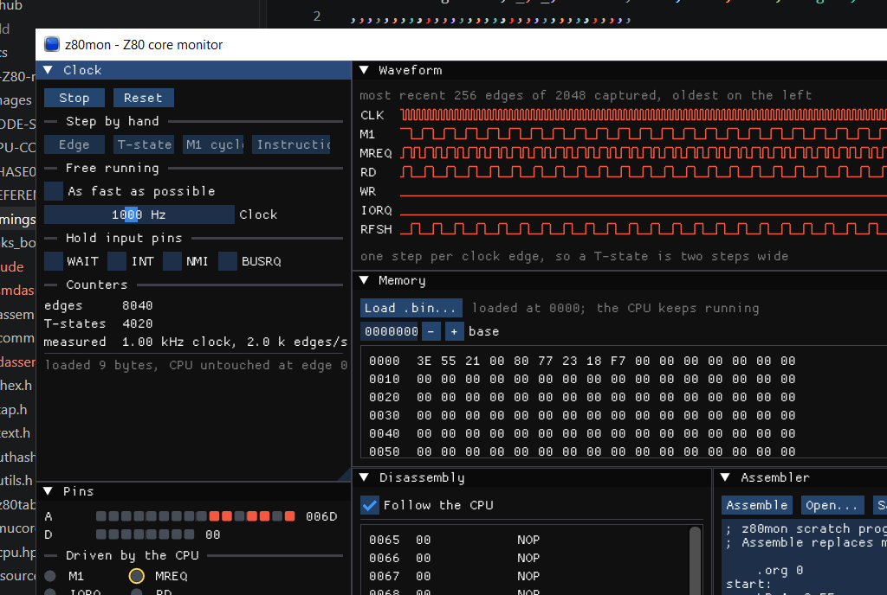

# z80mon

A window onto the CPU core: pins, clock control, memory and a waveform. The
core does not know it is being watched — z80mon is a host like any other, and
everything it does goes through `z80core.h`.



## Building

```sh
cmake --preset tools
cmake --build --preset tools
./build/tools/bin/z80mon
```

Dear ImGui is fetched at configure time and pinned to a release tag, so the
build needs the network once. The option defaults to **off** so an ordinary
build of `zasm` never downloads anything.

Windows only: the platform layer is Win32 plus WGL, which keeps the dependency
list at Dear ImGui and nothing else — no GLFW, no SDL, no loader library, no
runtime DLLs.

## What the panels do

**Clock.** Run or stop, and step by hand: one **edge** (half a T-state, the
smallest thing the core does), one **T-state**, one **M1 cycle**, or one
**instruction** — which runs until `M1` rises again, so the view always lands
on T1 of the next fetch. Free running takes a clock rate in Hz and issues two
edges per period, or unthrottled for as fast as the machine manages. The
counters show edges, T-states, and the rate actually achieved, which will fall
short of the requested one once the display cannot keep up.

**Pins.** The address and data buses as bits and as hex, then every control
pin as a lamp. A **ring around a lamp means that pin moved on the last edge** —
this is the changed-mask from `z80_tick()` displayed directly, and it is the
quickest way to see whether a signal is moving on the edge the datasheet says
it should. `WAIT`, `INT`, `NMI` and `BUSRQ` can be held from here.

**Waveform.** The last few hundred edges as digital traces. One step per clock
edge, so a T-state is two steps wide and a complete M1 fetch is eight. This is
where a mistimed signal is obvious rather than merely wrong.

**Memory.** 64K owned by the monitor, not by the core. It answers reads and
latches writes exactly as a schematic would. **Load .bin...** opens a file
picker; the byte at the current address is highlighted as the CPU walks
through it.

**Disassembly.** The listing at any address, decoded by **zasm's own
disassembler** rather than a second one written for the monitor — the same code
that round-trips a 16K ROM byte-exactly. Follow the CPU to keep the view on
whatever the address bus is showing, or untick it and type an address.

**Assembler.** An editor with an **Assemble** button: it builds the text with
`zasm` and loads the result straight into memory. Whatever `zasm` printed
appears underneath, so a syntax error arrives with its line number rather than
as a silent failure. **Open...** and **Save as...** work on `.asm` files.

## Loading never resets

Assembling or loading a binary replaces memory and leaves the CPU exactly where
it was — same PC, same edge count, still running if it was running. That is
what reprogramming a ROM does to a machine that is powered up, and it makes it
possible to patch code and watch the effect without losing the state that led
there.

**Reset** is the only thing that restarts the CPU, and it is one button away.

## What it is not

It is not a debugger yet — there is no register view, because during phase 0
there are no registers to speak of. When the core grows them, this is where
they will appear.
